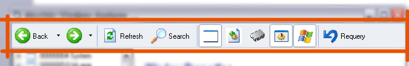



## A  XP toolbar

### Description

A simple and easy to use XP toolbar

as u c in the internet explorer with back forward,search etc buttons......

u can customize.. and add your own buttons...
 
### More Info
 

             |
---                |---
**Submitted On**   |2005-11-12 18:21:22
**By**             |[Arun P ;\-\)](https://github.com/Planet-Source-Code/PSCIndex/blob/master/ByAuthor/arun-p.md)
**Level**          |Beginner
**User Rating**    |3.8 (15 globes from 4 users)
**Compatibility**  |VB 6\.0
**Category**       |[OLE/ COM/ DCOM/ Active\-X](https://github.com/Planet-Source-Code/PSCIndex/blob/master/ByCategory/ole-com-dcom-active-x__1-29.md)
**World**          |[Visual Basic](https://github.com/Planet-Source-Code/PSCIndex/blob/master/ByWorld/visual-basic.md)
**Archive File**   |[A\_\_XP\_tool19479811132005\.zip](https://github.com/Planet-Source-Code/arun-p-a-xp-toolbar__1-63251/archive/master.zip)

